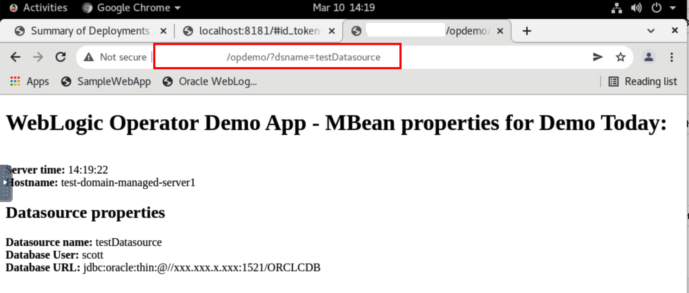
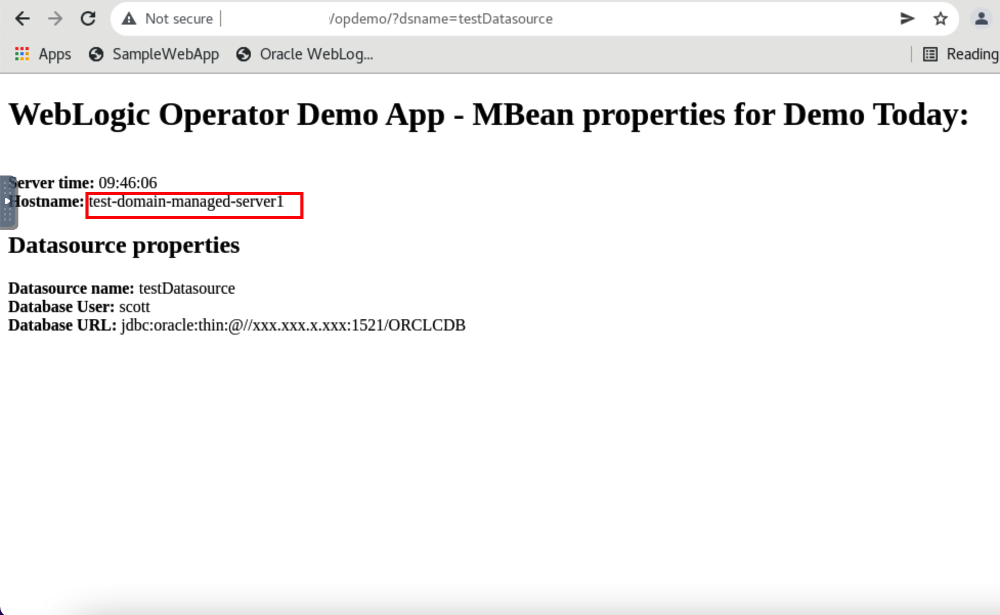

# Testing the Deployment of Application to the Oracle Container Engine for Kubernetes (OKE) on Oracle Cloud Infrastructure (OCI) 

## Introduction

### About Product/Technology

### Objectives

In this lab, you will:

* 

### Prerequisites

## Task 1: Access the Application through  the Browser

## Task 2: Connection to Admin Server using WebLogic Remote Console

## Acknowledgements

* **Author** -  Ankit Pandey
* **Contributors** - Maciej Gruszka, Sid Joshi
* **Last Updated By/Date** - Kamryn Vinson, January 2022