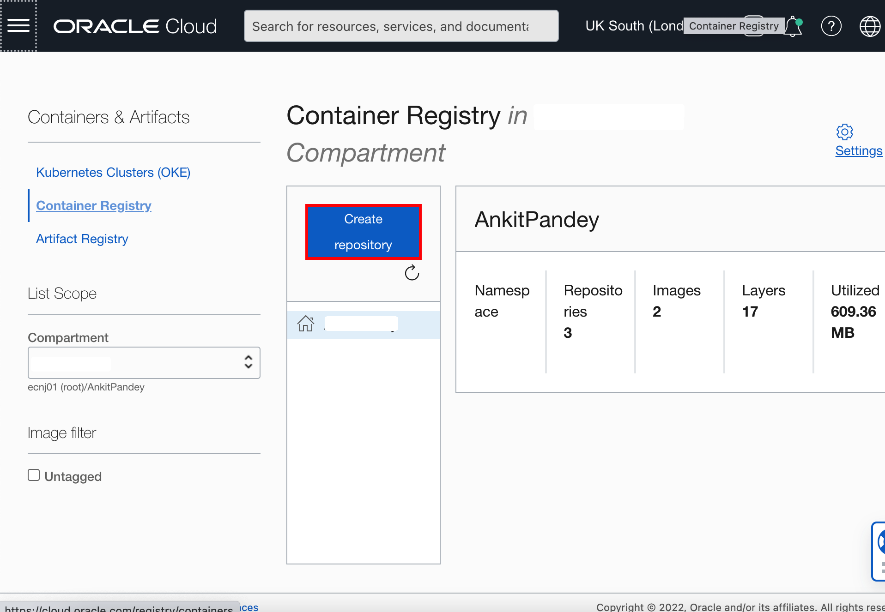

# Creation of Images for the Oracle Container Engine for Kubernetes (OKE) on Oracle Cloud Infrastructure (OCI)
## Introduction

### About Product/Technology

### Objectives

In this lab, you will:

* 

### Prerequisites

## Task 1: Creation of repository inside Oracle Cloud Container Registry Repository

## Task 2: Enter details of Primary Container Image 

## Task 3: Prepare Auxiliary Image and Push the Auxiliary Image to Oracle Container Image Registry 

## Acknowledgements

* **Author** -  Ankit Pandey
* **Contributors** - Maciej Gruszka, Sid Joshi
* **Last Updated By/Date** - Kamryn Vinson, January 2022