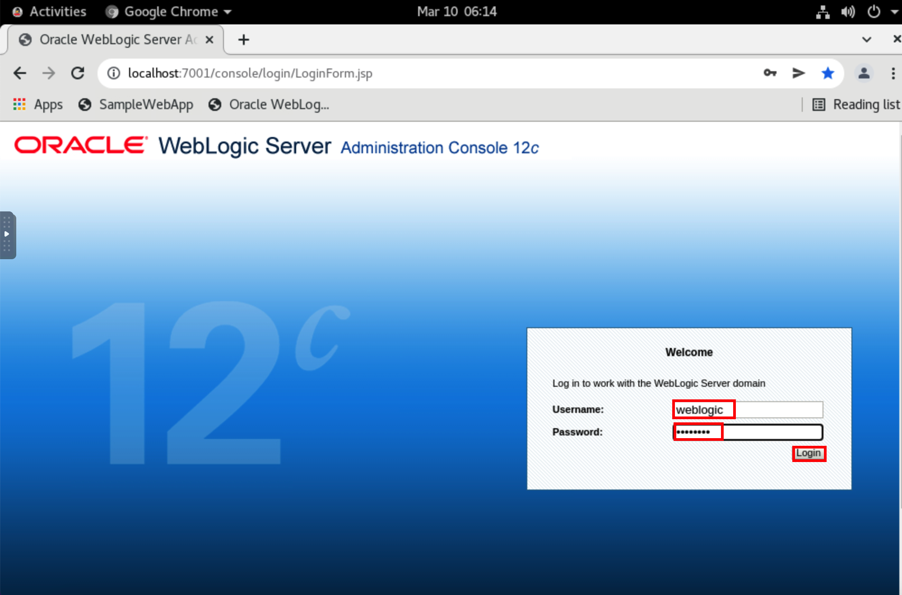
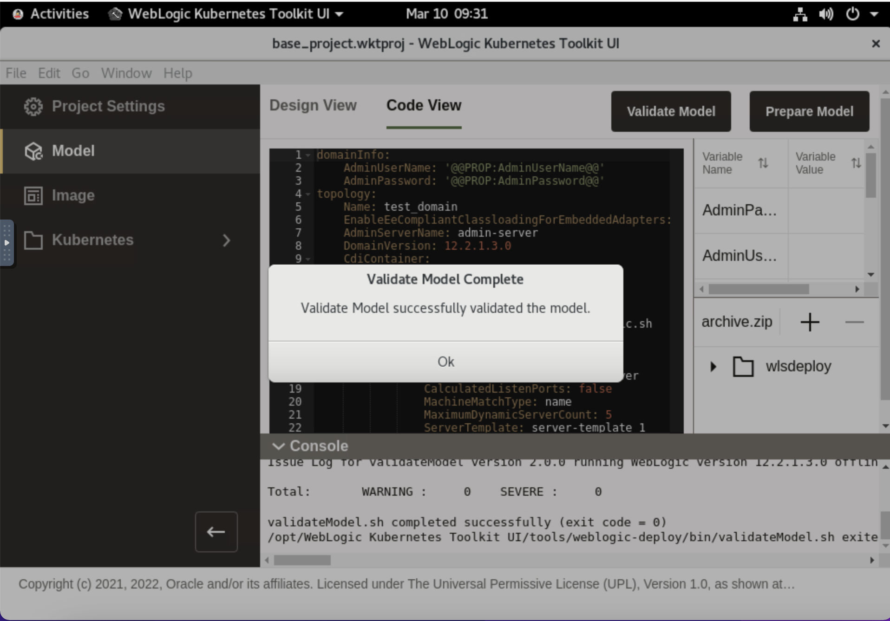
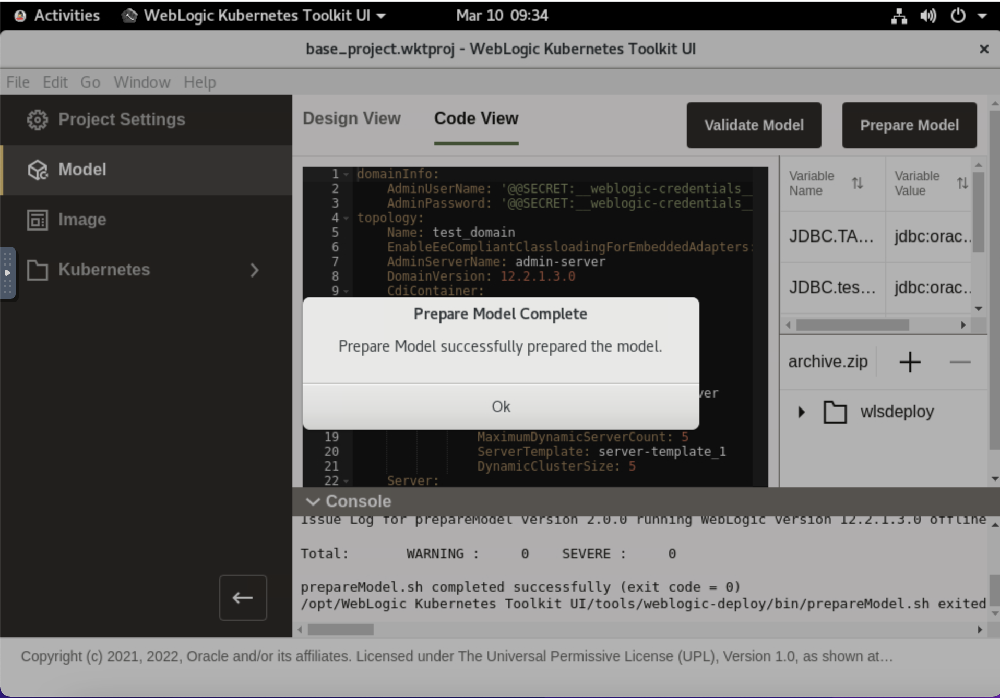

# Creation of Model for the Oracle Container Engine for Kubernetes (OKE) on Oracle Cloud Infrastructure (OCI)
## Introduction


### About Product/Technology


### Objectives

In this lab, you will:

* 

### Prerequisites


## Task 1: View the Resources in existing on-premise domain

1. On left side, click *Arrow Icon* -> *Setting Icon* and then select *Remote Resizing* as shown below.
    

2. To open the terminal, click *Activities* -> *Terminal icon*.
    

3. To run the Admin Server in *test-domain*, copy the following commands and paste it in terminal.
    ````bash
    <copy>cd ~/Oracle/Middleware/Oracle_Home/user_projects/domains/test_domain/bin/
    ./startWebLogic.sh</copy>
    ````
    
    
4. To open Chrome Browser, click *Activities* -> *Chrome Icon*.
    

5. During the whole workshop, whenever you see this window, enter *welcome1* as password and click *Unlock*.   
    

6. Click bookmark for *Oracle WebLogic Server Administrative Console*.
    
    
7. Enter *weblogic/Welcome1%* as `Username/Password`, then click *Login*. You can see, we have WebLogic Server version 12.2.1.3.0.   
    

8. To view available servers, click *Environment* -> *Servers*. You can see, we have one dynamic clusters with 5 managed servers. 
    

9. To view the datasources, click *Services* -> *Data Sources*.
    

10. To view the deployed application, click *Deployment*. You can see, we have *opdemo* as deployed application.
    

11. To shutdown the Admin Server, go back to terminal. Click *Activities* and select the *Terminal* window.
    

12. Press *`Ctrl + C`* to shutdown the Admin Server.
    


## Task 2: Opening the base WKT UI Project

1. Click *Activities* and then select the icon for *WebLogic Kubernetes Toolkit UI*.
    

2. We already created a project for you, which have common value pre-filled. To open that project, click *File* -> *Open Project*. 
    

3. Click *Downloads* in left side, then choose *base_project.wktproj* and click *Open Projects*.
    

    > Theory
    
    

    > Theory
    
    

    > Theory
    
    


## Task 3: Introspection of an Offline on-premise domain 

Now in this section, we will introspect the on-premise domain. 

1. Click *Model* as shown.
    

2. Click *File* -> *Add Model* -> *Discover Model(offline)*.
    

3. Click Open folder *icon* to open the *Domain Home*.
    

4. In the Home folder, navigate to *~/Oracle/Middleware/Oracle_Home/user_projects/domains/* directory and select *test-domain* folder then  click *Select*. Click *OK*.
    
    

5. You can see the window as shown below, at the end, you will have model ready for you.
    

## Task 4: Validate and Prepare Model to be deployed on Kubernetes Cluster

1. To Validate the model, click *Validate Model*.
    

2. Once model validation is successful and you see notification for the same, then click *Ok*.
    

3. To prepare the model, to be deployed on Kubernetes cluster, click *Prepare Model*
    

4. Once model is successfully prepared, click *Ok*.
    


## Acknowledgements

* **Author** -  Ankit Pandey
* **Contributors** - Maciej Gruszka, Sid Joshi
* **Last Updated By/Date** - Kamryn Vinson, January 2022