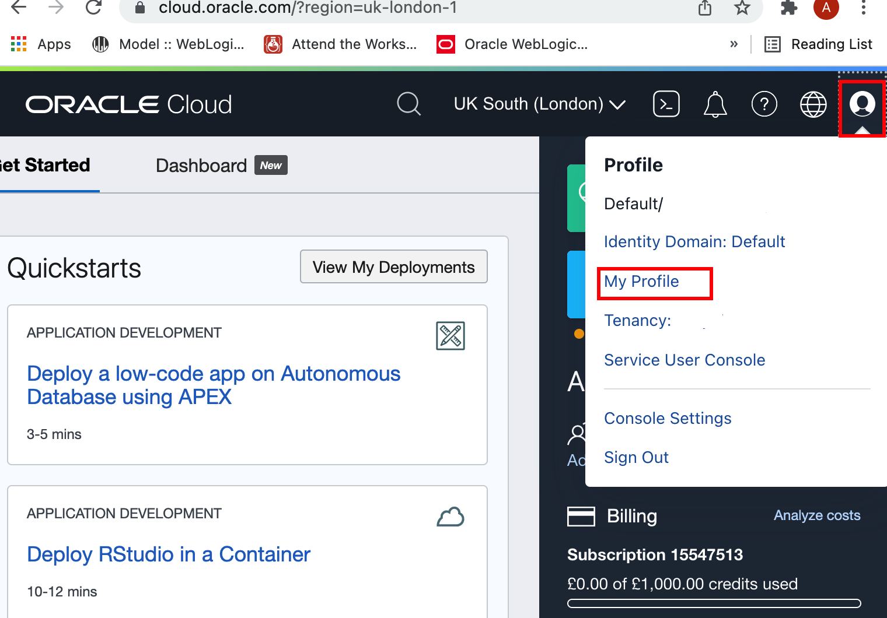
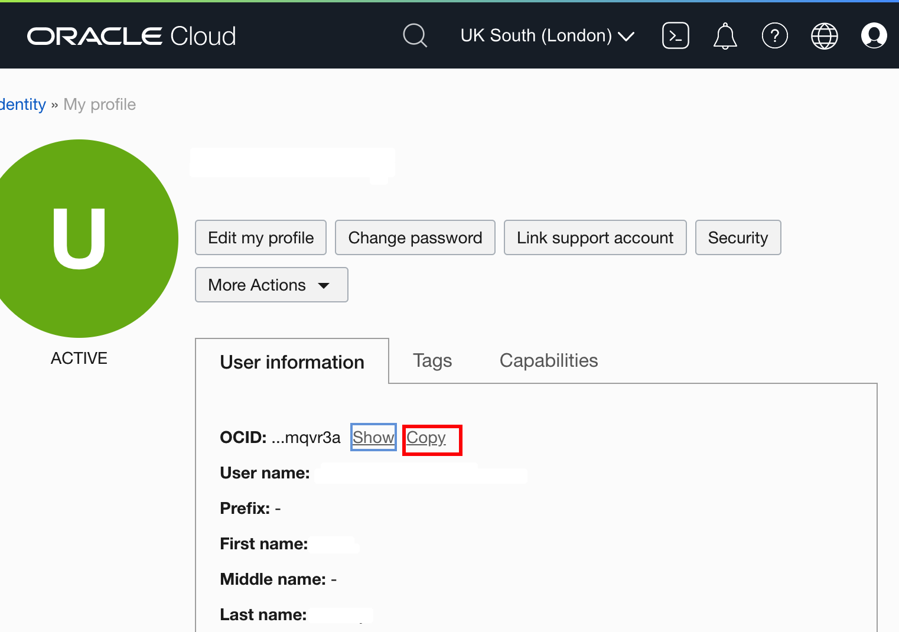
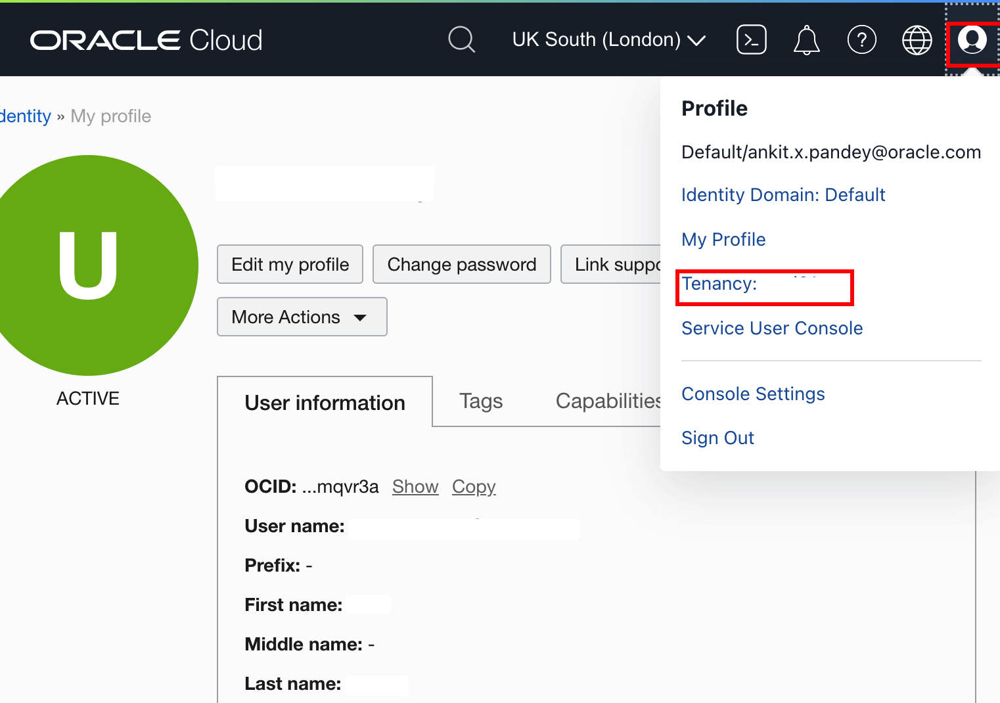
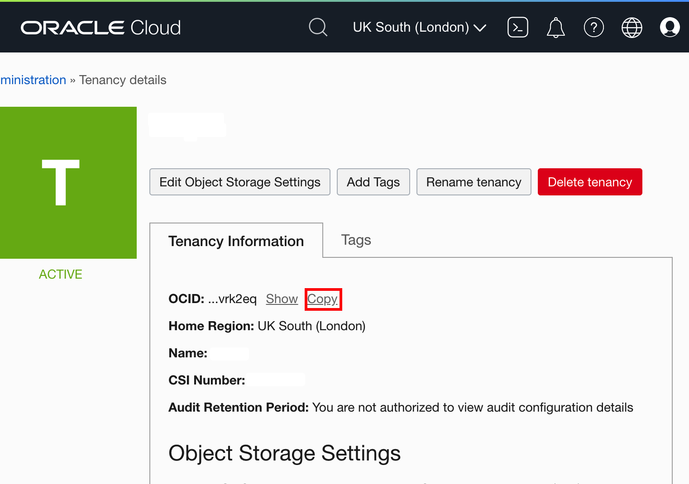
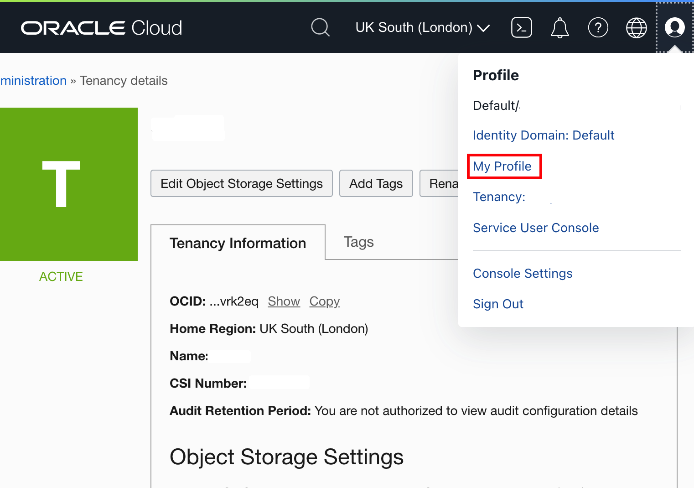
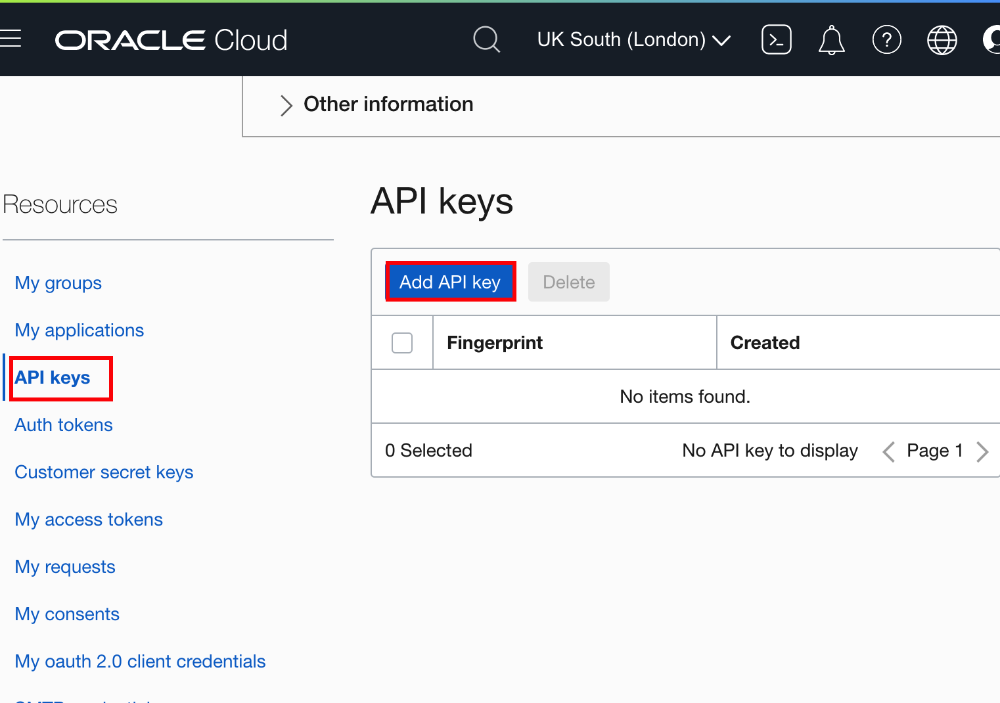
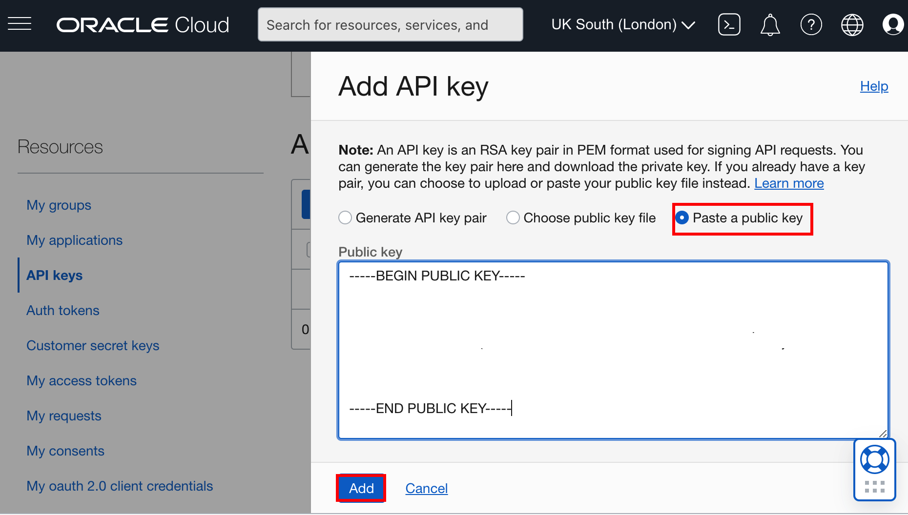

# Creation of VM from Maketplace Image
## Introduction


### About Product/Technology


### Objectives

In this lab, you will:

* 

### Prerequisites

You must have an [Oracle Cloud Infrastructure](https://cloud.oracle.com/en_US/cloud-infrastructure) enabled account.

## Task 1: Downloading the required artifacts from MarketPlace Image

## Task 2: Creation of VM from MarketPlace Image

## Task 3: Set up an Oracle Kubernetes Engine Instance on the Oracle Cloud Infrastructure

Oracle Cloud Infrastructure Container Engine for Kubernetes is a fully-managed, scalable, and highly available service that you can use to deploy your container applications to the cloud. Use the Container Engine for Kubernetes (sometimes abbreviated OKE) when your development team wants to reliably build, deploy, and manage cloud-native applications. You specify the compute resources that your applications require, and OKE provisions them on the Oracle Cloud Infrastructure in an existing OCI tenancy.

To create the Container Engine for Kubernetes (OKE), complete the following steps:

* Create the network resources (VCN, subnets, security lists, etc.).
* Create a cluster.
* Create a `NodePool`.

This tutorial shows you how the *Quick Start* feature creates and configures all the necessary resources for a 3-node Kubernetes cluster. All the nodes will be deployed in different availability domains to ensure high availability.

For more information about OKE and custom cluster deployment, see the [Oracle Container Engine](https://docs.cloud.oracle.com/iaas/Content/ContEng/Concepts/contengoverview.htm) documentation.

The *Quick Create* feature uses the default settings to create a *quick cluster* with new network resources as required. This approach is the fastest way to create a new cluster. If you accept all the default values, you can create a new cluster in just a few clicks. New network resources for the cluster are created automatically, along with a node pool and three worker nodes.

1. In the Console, select the *Hamburger Menu -> Developer Services -> Kubernetes Clusters (OKE)* as shown.

2. In the Cluster List page, select the Compartment of your choice, where you are allowed to create a cluster, and then click *Create Cluster*.

    > You need to select a compartment in which you are allowed to create a cluster and also, a repository inside the Oracle Container Registry.

3. In the Create Cluster Solution dialog, select *Quick Create* and click *Launch Workflow*.

    *Quick Create* will create a new cluster with the default settings, along with new network resources for the new cluster.

    Specify the following configuration details on the Cluster Creation page (please pay attention to the value you place in the *Shape* field):

    * **Name**: The name of the cluster. Leave the default value.
    * **Compartment**: The name of the compartment. Leave the default value.
    * **Kubernetes version**: The version of Kubernetes. Leave the default value which should be *v1.21.5* or select the latest version available.
    * **Kubernetes API Endpoint**: Are the cluster master nodes going to be routable or not. Select the *Public Endpoint* value.
    * **Kubernetes Worker Nodes**: Are the cluster worker nodes going to be routable or not. Leave the default *Private Workers* value.
    * **Shape**: The shape to use for each node in the node pool. The shape determines the number of CPUs and the amount of memory allocated to each node. The list shows only those shapes available in your tenancy that are supported by OKE. Select *VM.Standard.E2.1* (which is typically available in Oracle Free Tier Account).
    * **Number of nodes**: The number of worker nodes to create. Leave the default value, *3*.

4. Click *Next* to review the details you entered for the new cluster.

5. On the *Review* page, click *Create Cluster* to create the new network resources and the new cluster.

    > You see the network resources being created for you. Wait until the request to create the node pool is initiated and then click *Close*.


    > Then, the new cluster is shown on the *Cluster Details* page. When the master nodes are created, the new cluster gains a status of *Active* (it takes about 7 minutes).Then, you may continue your labs.

## Task 4: OCI CLI Authentication to Oracle Cloud Console

Oracle provides additional interfaces to interact with OCI resources programmatically, via Rest APIs, SDKs, and the Oracle Cloud Infrastructure Command Line Interface (OCI CLI), or short CLI. OCI CLI is extremely simple to use and integrate with your shell scripts to achieve even a much higher degree of automation.

From the security perspective, CLI is just “someone” who wants to access OCI resources and hence has to authenticate itself against the Cloud Control Plane.

Use an OCI user and an API key for authentication. In this case, you’ll need to put your tenancy OCID, user OCID, region name, the path to an API key, and the fingerprint of the API key. 








The easiest way is to let OCI walk you through the setup process by executing the following command:

```bash
<copy>oci setup config</copy>
```

```bash
$ oci setup config
    This command provides a walkthrough of creating a valid CLI config file.

    The following links explain where to find the information required by this
    script:

    User API Signing Key, OCID and Tenancy OCID:

        https://docs.cloud.oracle.com/Content/API/Concepts/apisigningkey.htm#Other

    Region:

        https://docs.cloud.oracle.com/Content/General/Concepts/regions.htm

    General config documentation:

        https://docs.cloud.oracle.com/Content/API/Concepts/sdkconfig.htm


Enter a location for your config [/home/opc/.oci/config]: 
Enter a user OCID: ocid1.user.oc1..aaaaaaaahz4xich2aa4bnd26hqleo37rqzccn5s2szk5ecyvxjkryymqvr3a
Enter a tenancy OCID: ocid1.tenancy.oc1..aaaaaaaabkswplpf4dyg3fhsthrbxuprhuvovdmc3vvwx3iozn4xwivrk2eq
Enter a region by index or name(e.g.
1: af-johannesburg-1, 2: ap-chiyoda-1, 3: ap-chuncheon-1, 4: ap-dcc-canberra-1, 5: ap-hyderabad-1,
6: ap-ibaraki-1, 7: ap-melbourne-1, 8: ap-mumbai-1, 9: ap-osaka-1, 10: ap-seoul-1,
11: ap-singapore-1, 12: ap-sydney-1, 13: ap-tokyo-1, 14: ca-montreal-1, 15: ca-toronto-1,
16: eu-amsterdam-1, 17: eu-frankfurt-1, 18: eu-marseille-1, 19: eu-milan-1, 20: eu-stockholm-1,
21: eu-zurich-1, 22: il-jerusalem-1, 23: me-abudhabi-1, 24: me-dcc-muscat-1, 25: me-dubai-1,
26: me-jeddah-1, 27: sa-santiago-1, 28: sa-saopaulo-1, 29: sa-vinhedo-1, 30: uk-cardiff-1,
31: uk-gov-cardiff-1, 32: uk-gov-london-1, 33: uk-london-1, 34: us-ashburn-1, 35: us-gov-ashburn-1,
36: us-gov-chicago-1, 37: us-gov-phoenix-1, 38: us-langley-1, 39: us-luke-1, 40: us-phoenix-1,
41: us-sanjose-1): 33
Do you want to generate a new API Signing RSA key pair? (If you decline you will be asked to supply the path to an existing key.) [Y/n]: y
Enter a directory for your keys to be created [/home/opc/.oci]: 
Enter a name for your key [oci_api_key]: 
Public key written to: /home/opc/.oci/oci_api_key_public.pem
Enter a passphrase for your private key (empty for no passphrase): 
Private key written to: /home/opc/.oci/oci_api_key.pem
Fingerprint: 30:08:34:02:e9:6f:5e:bc:32:e2:1b:73:a3:d3:5a:3c
Config written to /home/opc/.oci/config


    If you haven't already uploaded your API Signing public key through the
    console, follow the instructions on the page linked below in the section
    'How to upload the public key':

        https://docs.cloud.oracle.com/Content/API/Concepts/apisigningkey.htm#How2
$
```

```bash
<copy>vi .oci/oci_api_key_public.pem</copy>
```







## Acknowledgements

* **Author** -  Ankit Pandey
* **Contributors** - Maciej Gruszka, Sid Joshi
* **Last Updated By/Date** - Kamryn Vinson, March 2022
