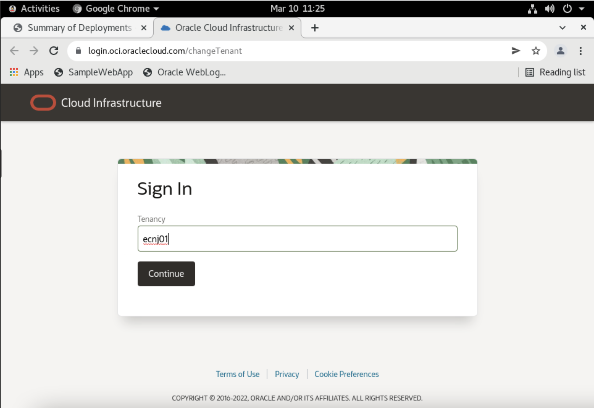
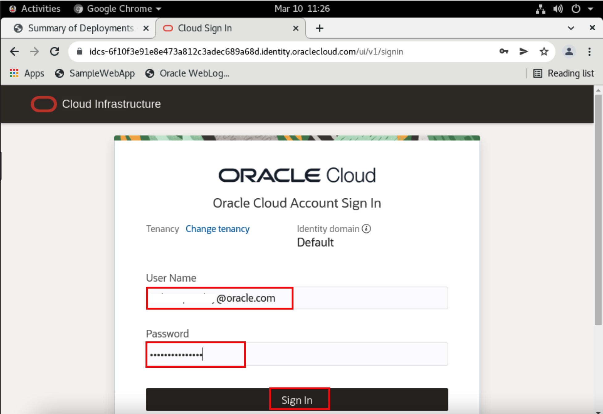
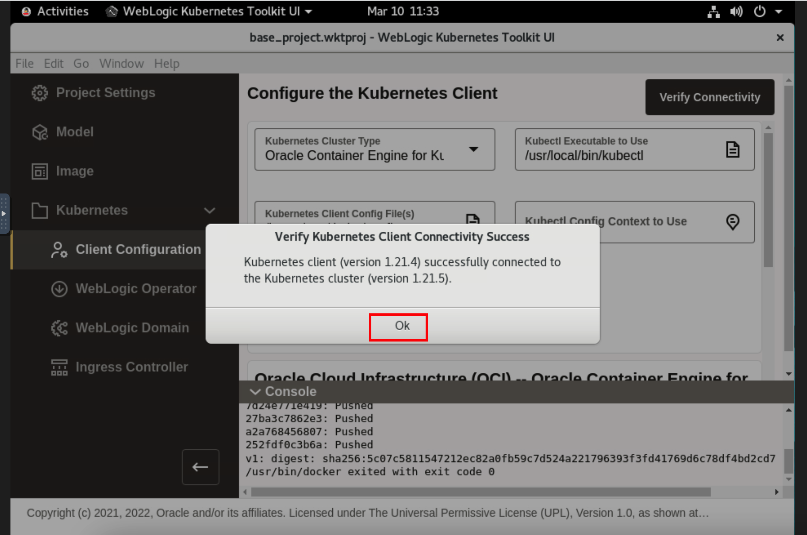

# Deployment of WebLogic Kubernetes Operator to the Oracle Container Engine for Kubernetes (OKE) on Oracle Cloud Infrastructure (OCI) From WebLogic Kubernetes Toolkit UI

## Introduction

### About Product/Technology

### Objectives

In this lab, you will:

* 

### Prerequisites

## Task 1: Configure kubectl (Kubernetes Cluster CLI) to connect to Oracle Container Engine for Kubernetes (OKE) on Oracle Cloud Infrastructure (OCI)

## Task 2: Verify Connectivity of WebLogic Kubernetes Toolkit UI to Oracle Container Engine for Kubernetes (OKE) on Oracle Cloud Infrastructure (OCI)

## Task 3: Install the WebLogic Kubernetes Operator

## Acknowledgements

* **Author** -  Ankit Pandey
* **Contributors** - Maciej Gruszka, Sid Joshi
* **Last Updated By/Date** - Kamryn Vinson, January 2022