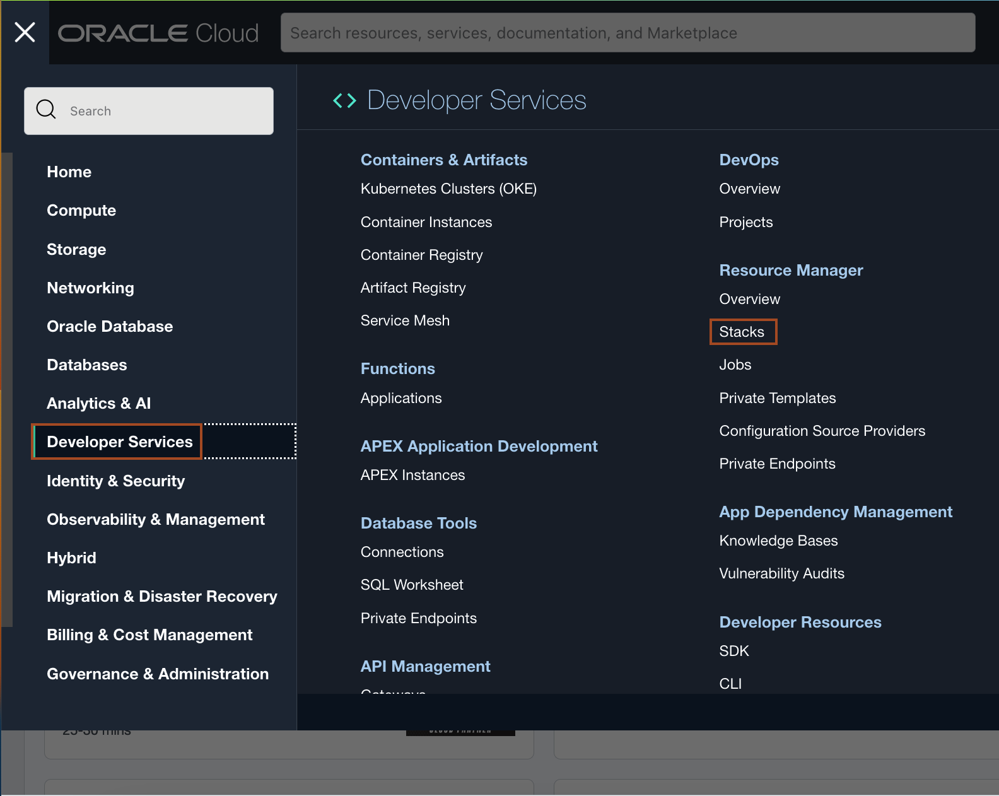
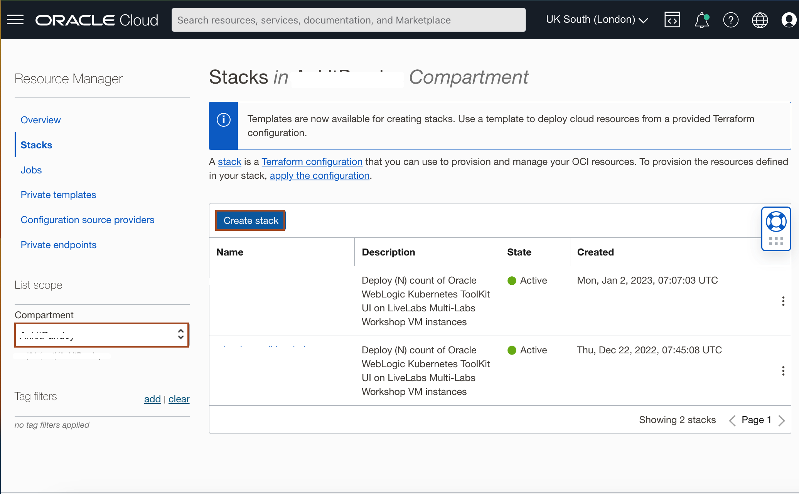
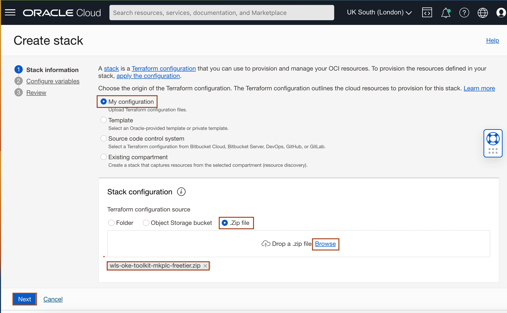
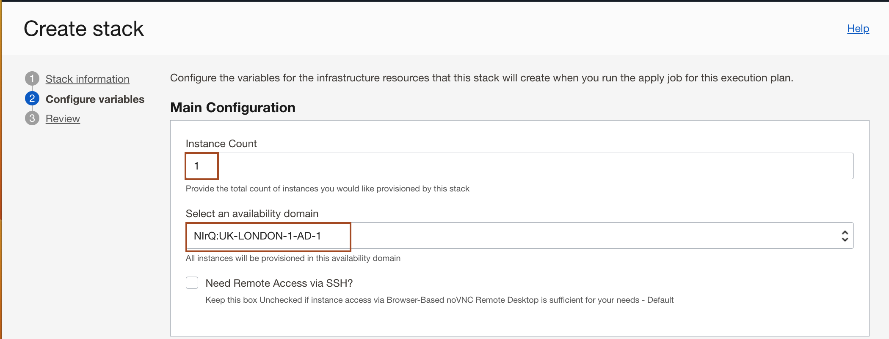
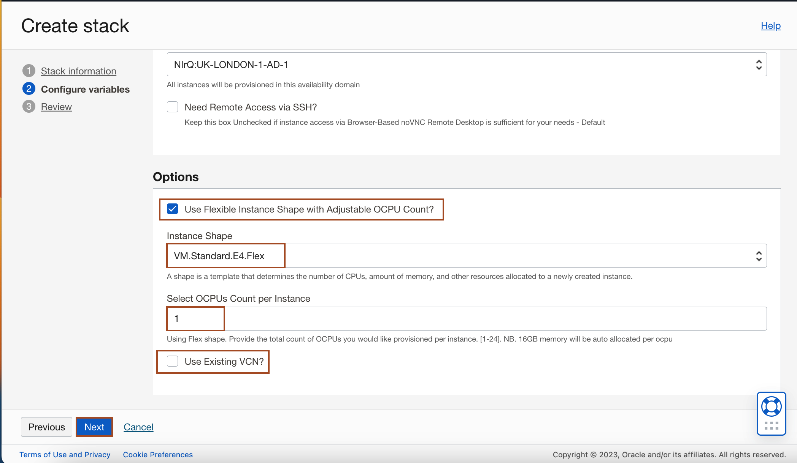
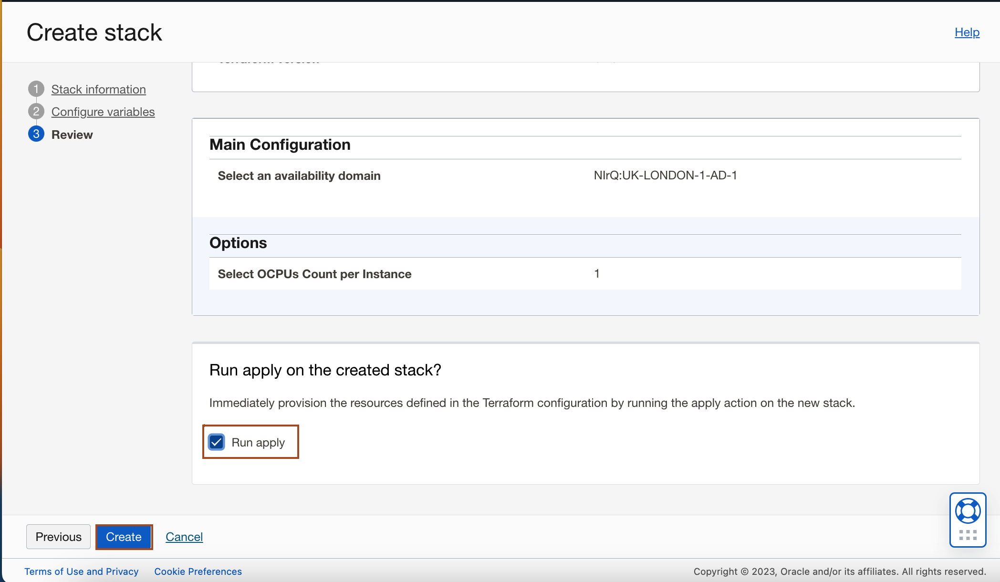
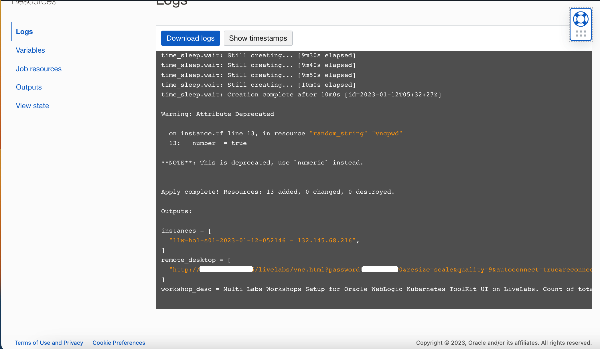
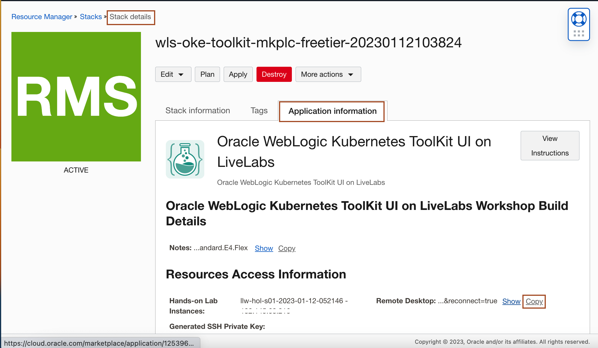

# Prepare Setup

## Introduction
This lab will show you how to download the Oracle Resource Manager (ORM) stack zip file needed to setup the resource needed to run this workshop. This workshop creates a compute instance and a Virtual Cloud Network (VCN).

*Estimated Lab Time:* 10 minutes

### Objectives
-   Download ORM stack
-   Create Stack: Compute + Networking using Resource Manager Stack
-   Access te Graphical Remote Desktop

### Prerequisites
This lab assumes you have:
- An Oracle Free Tier or Paid Cloud account

## Task 1: Download Oracle Resource Manager (ORM) stack zip file
1.  Click on the link below to download the Resource Manager zip file you need to build your environment:
    - [wls-oke-toolkit-mkplc-freetier.zip](https://objectstorage.us-ashburn-1.oraclecloud.com/p/bh1LaVd0DpYAVbAcrL4k-Y1WLC-KAEo117Msw7P2kN-xvNOWGaVcGtjxnkBVumb8/n/natdsecurity/b/stack/o/wls-oke-toolkit-mkplc-freetier.zip)

2.  Save in your downloads folder.

## Task 2: Create  Stack: Compute + Networking  

1. Log in to Oracle Cloud.

2. Open up the hamburger menu in the top left corner. Click **Developer Services**, and choose **Resource Manager** > **Stacks**. Choose the compartment in which you would like to install the stack. Click *Create Stack*.
        
    

3. Select *My Configuration*, choose the *.Zip* file button, click the *Browse* link, and select the zip file that you downloaded or drag-n-drop for the file explorer. Click *Next*.
    

4. Enter or select the following and then Click **Next**.
    * **Instance Count:**- Accept the default, 1, unless you intend to create more than one (e.g. for a team)
    * **Select Availability Domain:**- Select an availability domain from the dropdown list.
    * **Use Flexible Instance Shape with Adjustable OCPU Count?**- Keep the default as checked (unless you plan on using a fixed shape)
    * **Instance Shape**- Keep the default or select from the list of Flex shapes in the dropdown menu (e.g VM.Standard.E4.Flex).
    * **Select OCPUs Count per Instance**- Accept the default shown. e.g. (1) will provision 1 OCPUs and 16GB of memory. You may also elect to increase the count by selecting from the dropdown. e.g. [2-24]. Please ensure you have the capacity available before increasing.
    * **Use Existing VCN?**- For this section we will provision a new VCN with all the appropriate ingress and egress rules needed to run this workshop. Accept the default by leaving this unchecked. This will create a **new VCN**.   

    
    

5. Select **Run Apply** and click **Create**.
    

    > Your stack has now been created and the Apply action triggered is running to deploy your environment!

9. Review the job output.
    

    > Congratulations, your environment has been created! Your public IP address(es), instance name(s), and remote desktop URL are displayed.

## Task 3: Access the Graphical Remote Desktop 

For ease of execution of this workshop, your VM instance has been pre-configured with a remote graphical desktop accessible using any modern browser on your laptop or workstation. Proceed as detailed below to log in.

1. Navigate to Stack Details -> Application Information tab, and click the *Copy*.
    

2. Paste the URL in Chrome/Firebox browser to access the remote console.

You may now proceed to the next lab.

## Acknowledgements
* **Author** - Rene Fontcha, LiveLabs Platform Lead, NA Technology
* **Contributors** - Meghana Banka
* **Last Updated By/Date** - Rene Fontcha, LiveLabs Platform Lead, NA Technology, February 2022
