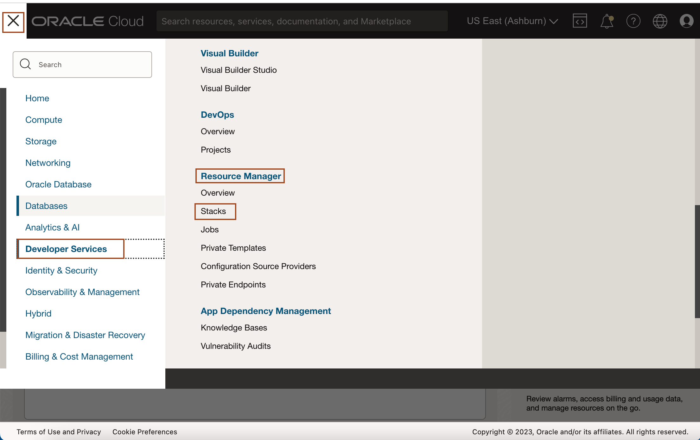
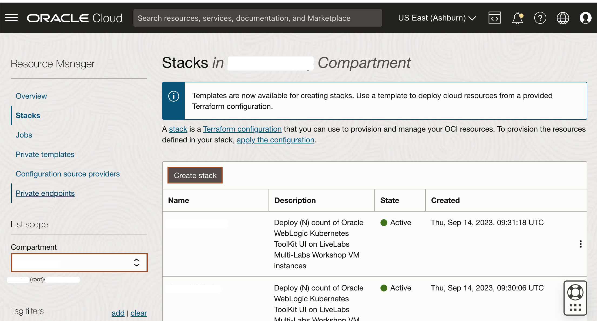
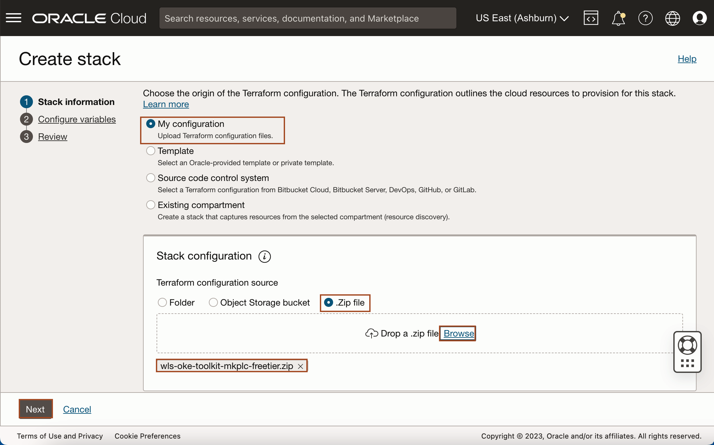
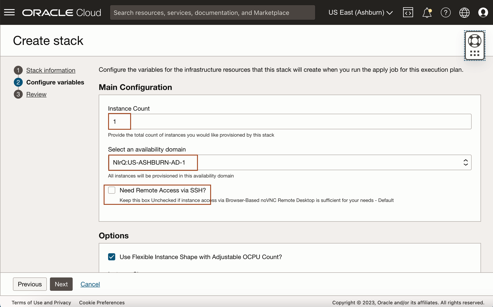
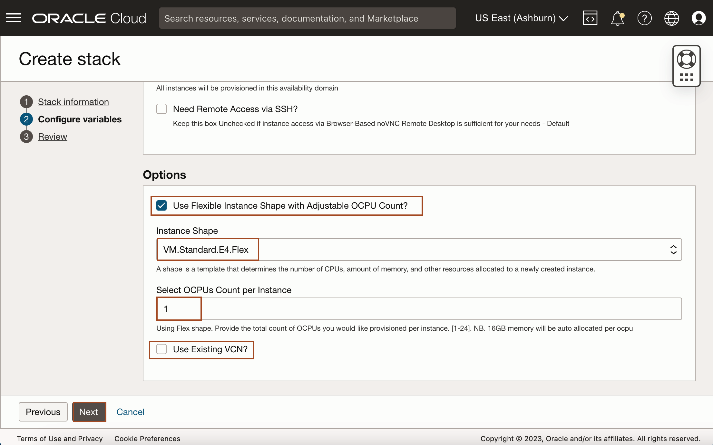
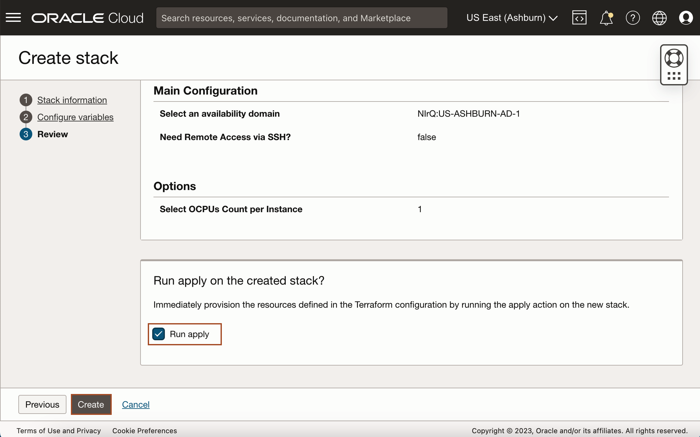

# Set up compute instance

## Introduction

This lab will show you how to set up a Resource Manager stack that will generate the Oracle Cloud objects needed to run your workshop.

Estimated Time: 15 minutes

### Objectives

In this lab, you will:

* Create Compute + Networking using Resource Manager Stack
* Connect to compute instance

### Prerequisites
This lab assumes you have:

* An Oracle Cloud account
* You have completed: **Lab: Prepare Setup**

## Task 1: Create Stack: Compute + Networking

1. Identify the ORM stack zip file downloaded in **Lab: Prepare Setup**.

2. Open up the hamburger menu in the top left corner. Click **Developer Services**, and choose **Resource Manager** > &**Stacks**. Choose the compartment in which you would like to install the stack. Click **Create Stack**.
    
    

3. Select **My Configuration**, choose the **.Zip** file button, click the **Browse** link, and select the zip file that you downloaded or drag-n-drop for the file explorer. Click **Next**.
    

4. Enter or select the following and click **Next**.
    **Instance Count:** Accept the default, 1.

    **Select Availability Domain:** Select an availability domain from the dropdown list.

    **Need Remote Access via SSH?** Keep Unchecked for Remote Desktop only Access - The Default.

    **Use Flexible Instance Shape with Adjustable OCPU Count?:** Keep the default as checked (unless you plan on using a fixed shape).

    **Instance Shape:** Keep the default or select from the list of Flex shapes in the dropdown menu (e.g VM.Standard.E4.Flex).

    **Select OCPUs Count per Instance:** Accept the default shown. e.g. (1) will provision 1 OCPUs and 16GB of memory. 

    **Use Existing VCN?:** Accept the default by leaving this unchecked. This will create a new VCN.
    
    

7. Select **Run Apply** and click **Create**.
    

You may now proceed to the next lab.

## Acknowledgements

* **Author** -  Ankit Pandey
* **Contributors** - Maciej Gruszka, Sid Joshi
* **Last Updated By/Date** - Ankit Pandey, August 2023